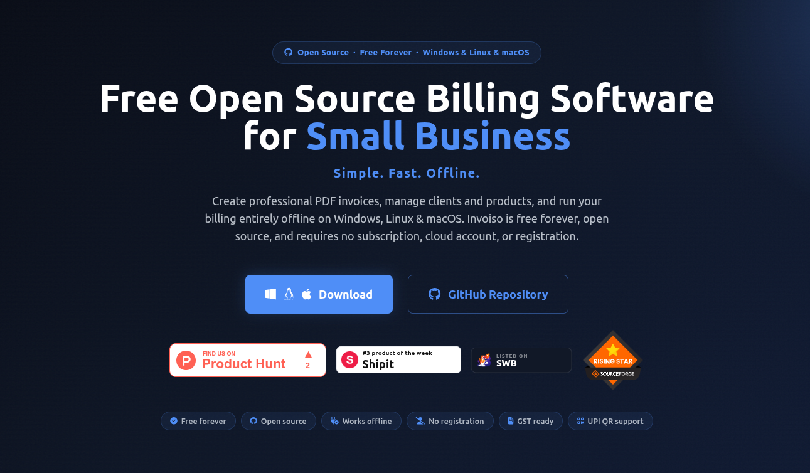
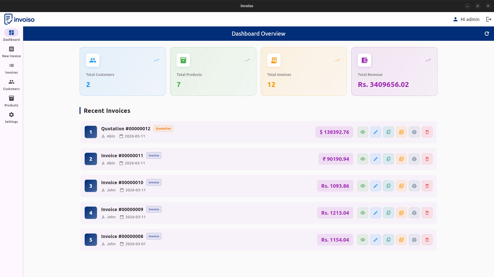
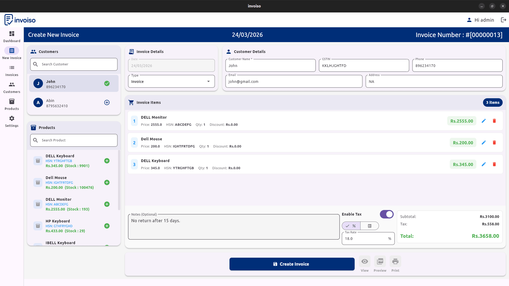
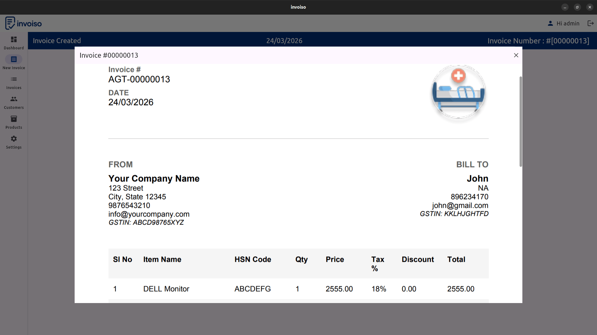
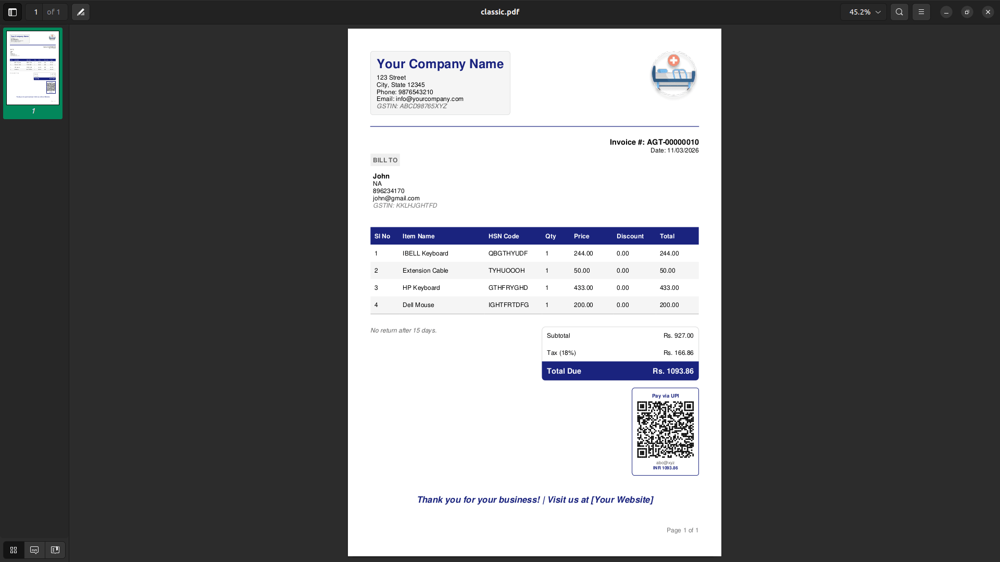
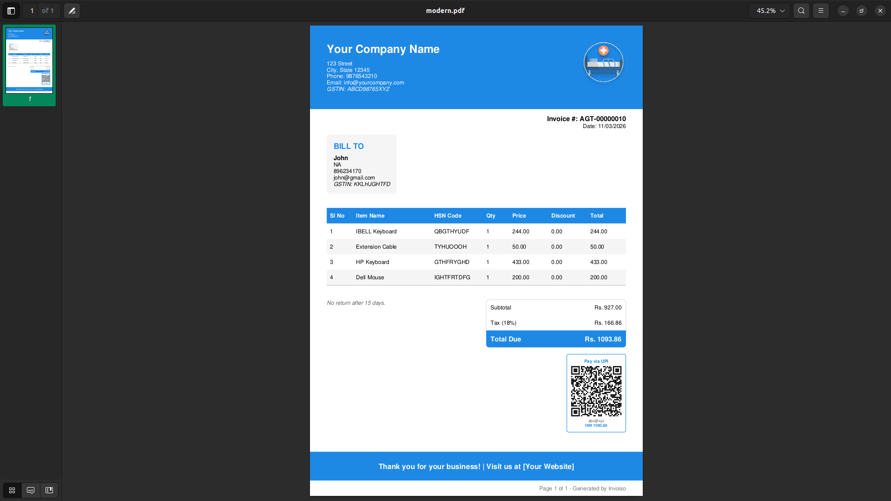
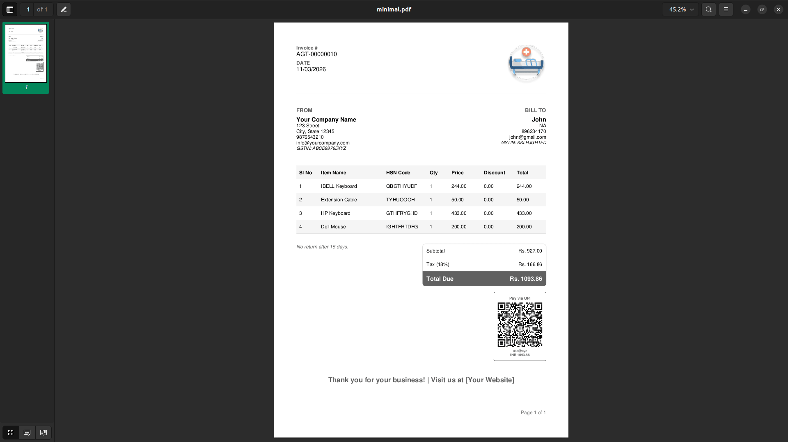

<div align="center">
  

  <h1>Invoiso</h1>

  <p><strong>Free offline invoice &amp; billing software for Windows &amp; Linux</strong></p>
  <p>Create professional PDF invoices, manage customers, products and inventory — entirely offline. Built for small businesses, shops and freelancers. No subscription, no cloud, no account needed.</p>

  <p>
    <a href="https://github.com/Anooppandikashala/invoiso/releases/latest">
      
    </a>
    
    
    
    
  </p>

  <p>
    <a href="https://anooppandikashala.github.io/invoisoapp/">🌐 Website</a> &nbsp;·&nbsp;
    <a href="https://anooppandikashala.github.io/invoisoapp/download.html">⬇️ Download</a> &nbsp;·&nbsp;
    <a href="https://anooppandikashala.github.io/invoisoapp/faq.html">❓ FAQ</a> &nbsp;·&nbsp;
    <a href="https://github.com/Anooppandikashala/invoiso/issues">🐛 Report a Bug</a>
  </p>

  <br/>

  
</div>

---

## ✨ Features

- **100% Offline** — All data stored locally in SQLite. No internet required, ever.
- **PDF Invoice Generation** — One-click professional PDFs in Classic, Modern or Minimal templates.
- **Invoice & Quotation** — Create both invoice and quotation documents with colour-coded tracking.
- **Invoice Cloning** — Duplicate any invoice or quotation with one click.
- **Bulk Actions** — Multi-select invoices to bulk export CSV, generate PDFs, or move to trash.
- **UPI Payment QR** — Embed a scannable UPI QR code in every PDF (GPay, PhonePe, Paytm).
- **GST Ready** — GSTIN fields, HSN codes, per-item or global tax rate for Indian businesses.
- **Multi-Currency** — INR, USD, EUR, GBP, JPY, AED, SGD, AUD, CAD, JMD.
- **Customer & Product Management** — Full CRUD with search, sort, and pagination.
- **Soft Delete / Trash** — Deleted invoices are recoverable from the Trash view.
- **CSV Export** — Export invoice data to CSV for use in spreadsheets or accounting software.
- **Backup & Restore** — One-click database backup to any location on your machine.
- **No Registration** — No account, no email, no cloud sync required.
- **Free Forever** — MIT licensed, open source.

---

## 📸 Screenshots

<div align="center">

| Dashboard | Create Invoice | Invoice PDF |
|:---------:|:--------------:|:-----------:|
|  |  |  |

| Classic Template | Modern Template | Minimal Template |
|:---------------:|:---------------:|:----------------:|
|  |  |  |

</div>

---

## ⬇️ Download

| Platform | Format | Link |
|----------|--------|------|
| **Windows** | `.exe` Installer | [Latest Release](https://github.com/Anooppandikashala/invoiso/releases/latest) |
| **Linux** | `.AppImage` (portable) | [Latest Release](https://github.com/Anooppandikashala/invoiso/releases/latest) |
| **Linux** | `.deb` Package | [Latest Release](https://github.com/Anooppandikashala/invoiso/releases/latest) |

> Always download from the [official releases page](https://github.com/Anooppandikashala/invoiso/releases/latest).

---

## 🛠️ Build from Source

### Prerequisites

- [Flutter SDK](https://flutter.dev/docs/get-started/install) `>=3.3.3`
- Linux: standard build tools (`clang`, `cmake`, `ninja-build`, `libgtk-3-dev`)
- Windows: Visual Studio 2022 with "Desktop development with C++" workload

### Steps

```bash
# 1. Clone the repository
git clone https://github.com/Anooppandikashala/invoiso.git
cd invoiso

# 2. Install dependencies
flutter pub get

# 3. Run in debug mode
flutter run -d linux      # Linux
flutter run -d windows    # Windows

# 4. Build a release binary
flutter build linux --release    # Linux
flutter build windows --release  # Windows
```

The output binary is placed in `build/linux/x64/release/bundle/` (Linux) or `build/windows/x64/runner/Release/` (Windows).

---

## 🏗️ Tech Stack

| Layer | Technology |
|-------|-----------|
| Framework | [Flutter](https://flutter.dev) 3.x (Dart) |
| Database | SQLite via [sqflite](https://pub.dev/packages/sqflite) + [sqflite_common_ffi](https://pub.dev/packages/sqflite_common_ffi) |
| PDF Generation | [pdf](https://pub.dev/packages/pdf) + [printing](https://pub.dev/packages/printing) |
| QR Codes | [qr](https://pub.dev/packages/qr) |
| State Management | [flutter_riverpod](https://pub.dev/packages/flutter_riverpod) |
| File Picker | [file_picker](https://pub.dev/packages/file_picker) |
| CSV Export | [csv](https://pub.dev/packages/csv) |
| Window Management | [window_manager](https://pub.dev/packages/window_manager) |

---

## 📁 Project Structure

```
lib/
├── main.dart                   # App entry point
├── common.dart                 # Shared enums and data classes
├── constants.dart              # UI constants and app config
├── database/                   # SQLite services (CRUD for each entity)
├── models/                     # Data models (Invoice, Customer, Product, ...)
├── providers/                  # Riverpod state providers
├── screens/                    # All UI screens
├── services/                   # PDF generation, CSV/PDF export
├── backup/                     # Backup and restore logic
└── utils/                      # Logger, formatters, password utils, error handler
```

---

## 🤝 Contributing

Contributions, bug reports, and feature requests are welcome.

1. **Fork** the repository
2. **Create** a feature branch: `git checkout -b feature/your-feature`
3. **Commit** your changes: `git commit -m "Add your feature"`
4. **Push** to the branch: `git push origin feature/your-feature`
5. **Open a Pull Request**

For bug reports and feature requests, please use [GitHub Issues](https://github.com/Anooppandikashala/invoiso/issues).

---

## 📄 License

Invoiso is released under the [MIT License](LICENSE).
Copyright © 2025 [Anoop Pandikashala](https://github.com/Anooppandikashala)

---

<div align="center">
  <p>If Invoiso saves you time, consider supporting its development.</p>

  [](https://www.buymeacoffee.com/anoopp)
</div>


